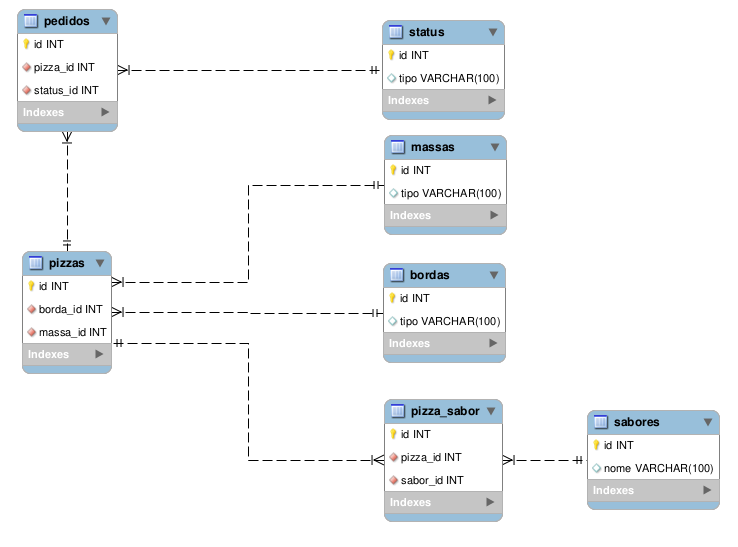
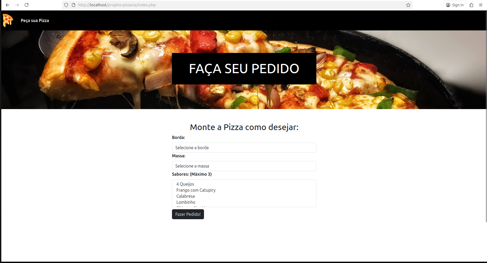
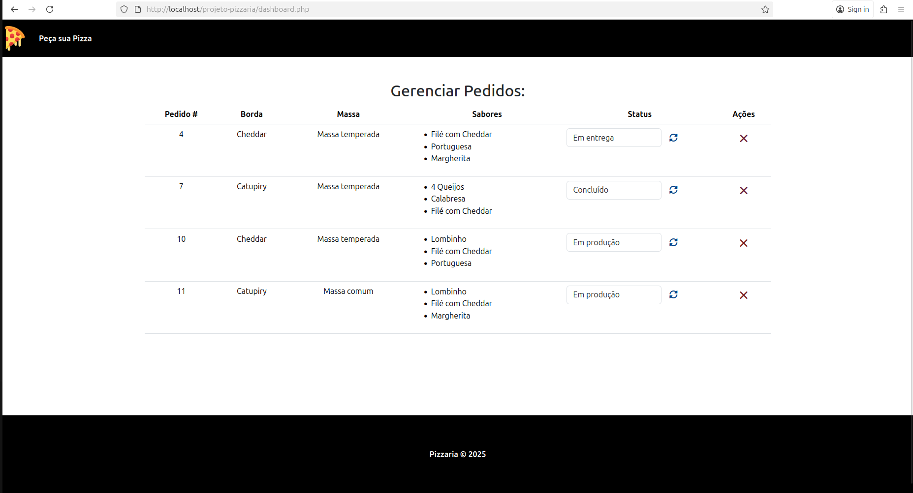

# 🍕 Projeto Pizzaria

## 📘 Descrição

O **Projeto Pizzaria** foi desenvolvido com o objetivo de praticar conceitos de **design de banco de dados relacionais** e **modelagem de dados**, aplicados a um sistema de **gerenciamento de pedidos de pizzaria**.
O projeto utiliza tecnologias web modernas e segue boas práticas de desenvolvimento para criar uma aplicação simples, funcional e de fácil manutenção.

---

## 🧩 Tecnologias Utilizadas

* **Frontend:** HTML5, CSS3, Bootstrap
* **Backend:** PHP
* **Banco de Dados:** MySQL
* **Outros:** XAMPP / Apache (ambiente local de desenvolvimento)

---

## 🗂️ Estrutura do Projeto

```
projeto-pizzaria/
├── index.php
├── dashboard.php
├── templates/
│   ├── header.php
│   └── footer.php
├── process/
├── └── conexao.php
│   └── pizza.php
│   └── pedidos.php
├── css/
│    └── style.css
├── img/
│    └── pizza-banner.jpg
│    └── pizzar.svg
```

---

## 🧠 Conceitos Aplicados

* Modelagem de dados e normalização de tabelas
* Relacionamentos entre entidades (1:N, N:N)
* Boas práticas em design de banco de dados relacional
* Separação entre camadas de apresentação e lógica
* Integração entre PHP e MySQL

---

## 🗺️ Diagrama do Banco de Dados



---

## 💻 Funcionalidades

* Cadastro e exibição de bordas e massas
* Montagem de pizzas com múltiplos sabores
* Registro e listagem de pedidos
* Interface responsiva com Bootstrap
* Integração com banco de dados MySQL

---

## 🧰 Como Executar o Projeto

1. **Clone o repositório**

   ```bash
   git clone https://github.com/seuusuario/projeto-pizzaria.git
   ```

2. **Configure o ambiente**

   * Instale o [XAMPP](https://www.apachefriends.org/index.html) ou similar.
   * Coloque o projeto dentro da pasta `htdocs` (ex: `C:\xampp\htdocs\projeto-pizzaria`).

3. **Crie o banco de dados**

   * Acesse o **phpMyAdmin**.
   * Importe o arquivo `pizzaria.sql` localizado na pasta `database/`.

4. **Execute o projeto**

   * Inicie o Apache e o MySQL no XAMPP.
   * Acesse no navegador:

     ```
     http://localhost/projeto-pizzaria
     ```

---

## 🖼️ Capturas de Tela


### Página Inicial



### Dashboard 



---

## 🪶 Licença

Este projeto é de uso livre para fins educacionais e de aprendizado.

